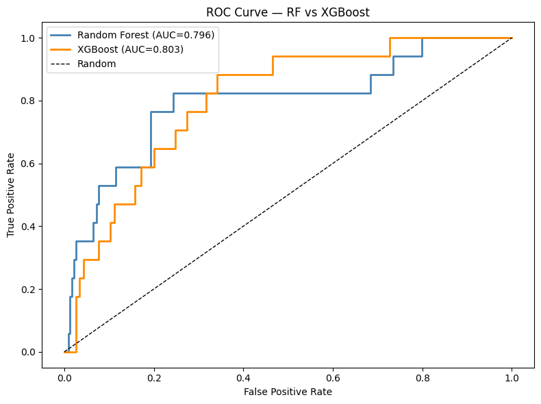
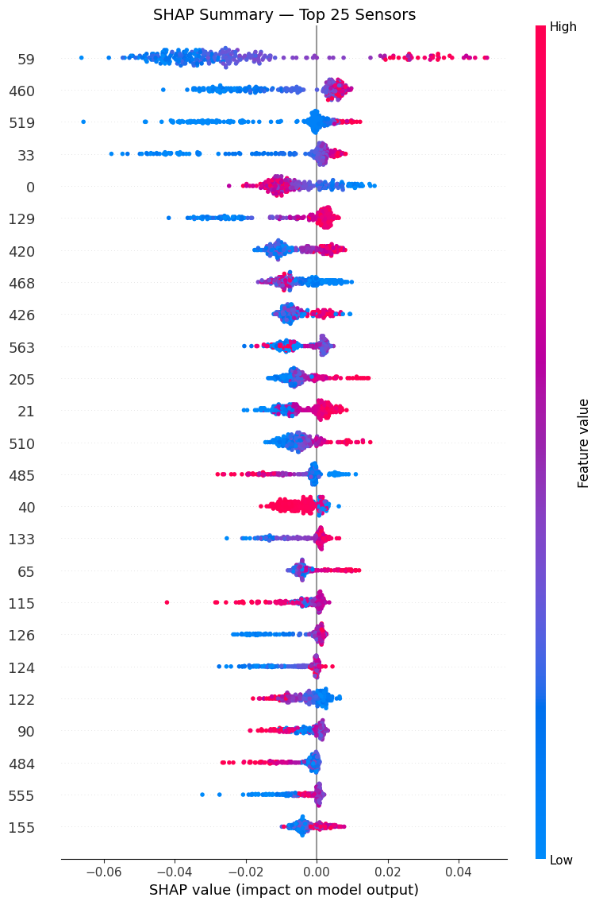
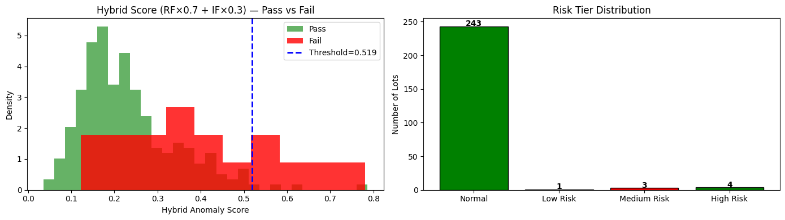
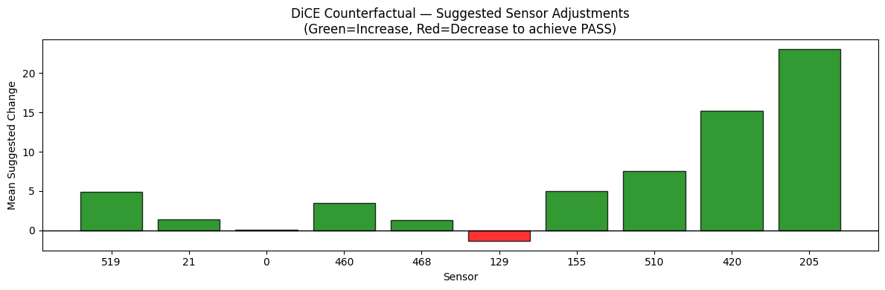

# AI-Based Yield Anomaly Detection & Root Cause Analysis for Semiconductor Manufacturing

A hybrid supervised/unsupervised machine learning system that detects anomalous production lots in semiconductor wafer manufacturing, explains *why* they were flagged at the sensor level, and generates actionable, LLM-written engineering recommendations — all wrapped in an interactive Streamlit dashboard.

Built on the [SECOM dataset](https://archive.ics.uci.edu/dataset/179/secom) (UCI Machine Learning Repository): 1,567 production lots × 590 process sensor readings, with a 6.6% failure rate.

> This project was developed as part of an MS dissertation in Data Science (VIT Chennai, 2026). Full write-up: see `docs/` or request the PDF.

---

## Why this project

Most yield-monitoring pipelines in semiconductor fabs are reactive pass/fail classifiers. They don't tell an engineer *which sensor* drove a flag, whether that signal is trustworthy across retrains, or *what to adjust* to fix it. This project builds all three of those layers on top of a standard classifier:

1. **Detect** — a hybrid anomaly score combining a supervised classifier and an unsupervised outlier detector
2. **Explain** — SHAP feature attribution, validated for stability across 50 bootstrap retrains (not just a single model fit)
3. **Recommend** — counterfactual sensor adjustments (DiCE) restricted to the sensors proven stable in step 2, scored with a custom partial-improvement metric

---

## Architecture

```
Data Layer → Preprocessing → Modeling → Explainability → Counterfactuals → Dashboard
   (SECOM)     (590→195         (RF + IF        (SHAP +          (DiCE,          (Streamlit +
                 features)        hybrid          bootstrap        SHAP-filtered)   Groq LLM
                                  score)           stability)                       reports)
```

| Stage | Technique | Notebook |
|---|---|---|
| Preprocessing | Missing-value filtering, median imputation, variance filtering, Pearson correlation reduction, standard scaling | `notebooks/p1.ipynb` |
| Baseline classification | Random Forest vs. XGBoost, class-imbalance handling | `notebooks/p2.ipynb` |
| Hybrid anomaly detection | RF failure probability + Isolation Forest score, weights via grid search | `notebooks/p3.ipynb` |
| Feature attribution | TreeSHAP + 50-run bootstrap stability scoring | `notebooks/p4.ipynb` |
| Sensor dependency analysis | Pearson correlation clustering of stable sensors | `notebooks/p5.ipynb` |
| Trend / hypothesis generation | — | `notebooks/p6.ipynb` |
| Counterfactual generation | SHAP-filtered genetic DiCE, CSR + custom PCR metric | `notebooks/p7.ipynb` |
| Dashboard integration | Streamlit app assembly | `notebooks/p8.ipynb`, `app.py` |
| LLM report generation | Groq-based structured engineering reports | `notebooks/p9.ipynb` |

---

## Results

| Model | ROC-AUC | Recall (failure class) |
|---|---|---|
| Random Forest | 0.7961 | 0.4118 |
| XGBoost | 0.8032 | 0.3529 |

Random Forest was selected as the primary model for its higher recall on the minority failure class — the more operationally important metric for yield monitoring, where missing a real failure is costlier than a false alarm.

**Hybrid anomaly detector** (RF weight 0.7, Isolation Forest weight 0.3, threshold τ = 0.519 = mean + 2σ of normal training scores):
- 8 production lots flagged on the test set
- 5 true failures correctly identified, 3 false positives
- Precision: 0.625

**Feature attribution:** Sensor 59 was the single most consistent driver of anomalous predictions, appearing in the top-ranked SHAP features in **all 50 of 50** bootstrap retrains — a stability score of 1.0.

**Counterfactual correction:**
- Correction Success Rate (CSR): 0.00 (no counterfactual fully crossed the decision threshold — expected, given how tightly the decision boundary is packed in this imbalanced dataset)
- **Partial Correction Rate (PCR): 0.28** — a metric proposed in this project to capture *directional* improvement even when full correction isn't achieved. On average, suggested sensor adjustments closed 28% of the gap to a "pass" prediction.

| ROC Curves | SHAP Summary | Hybrid Anomaly Score | Counterfactual Adjustments |
|---|---|---|---|
|  |  |  |  |

---

## Dashboard

The Streamlit app (`app.py`) ties every stage together into three views:

- **Lot Analysis** — hybrid anomaly score, risk tier, top contributing sensors for any selected lot
- **Sensor Deviation** — SHAP contributions and standard-deviation-from-normal for flagged sensors
- **Recommendations** — counterfactual-driven, LLM-generated engineering reports (executive summary, risk assessment, recommended actions, confidence statement) via Groq

---

## Getting started

```bash
# Clone
git clone https://github.com/<your-username>/secom-yield-anomaly-rca.git
cd secom-yield-anomaly-rca

# Set up environment
python -m venv venv
source venv/bin/activate       # Windows: venv\Scripts\activate
pip install -r requirements.txt

# (Optional) enable LLM report generation
export GROQ_API_KEY="your-key-here"   # Windows: set GROQ_API_KEY=your-key-here

# Run the dashboard
streamlit run app.py
```

The dashboard reads precomputed outputs from `outputs/`. To regenerate everything from raw data, run the notebooks in `notebooks/` in order (`p1` → `p9`); each writes its outputs to `outputs/data/`, `outputs/models/`, and `outputs/plots/`, which downstream notebooks and the dashboard consume.

Raw data lives in `data/` (`secom.data`, `secom_labels.data`, feature descriptions in `secom.names`), sourced from the [UCI SECOM dataset](https://archive.ics.uci.edu/dataset/179/secom).

---

## Repository structure

```
├── app.py                  # Streamlit dashboard
├── check.py                # Quick data-integrity sanity check
├── requirements.txt
├── data/                   # Raw SECOM dataset
├── notebooks/              # p1–p9: full pipeline, run in order
├── outputs/
│   ├── data/                # Intermediate CSV/JSON/NPY artifacts
│   ├── models/               # Trained model files + saved thresholds/weights
│   ├── plots/                 # Generated figures
│   └── reports/                # Sample per-lot LLM-generated reports
└── assets/                 # Images used in this README
```

---

## Key methodological contributions

1. **Bootstrap-validated SHAP stability** — 50-run resampling to test whether feature attributions are robust or an artifact of one training split, rather than trusting a single SHAP fit.
2. **SHAP-filtered genetic DiCE counterfactuals** — restricting which sensors DiCE is allowed to vary to only those proven stable, so recommendations are grounded rather than arbitrary.
3. **Partial Correction Rate (PCR)** — a continuous metric supplementing binary Correction Success Rate, designed for highly imbalanced industrial datasets where full threshold-crossing is rare but partial improvement is still meaningful and worth measuring.

---

## Limitations

- SECOM is severely imbalanced (104 failures / 1,567 lots); this constrains supervised learning and contributes to false positives.
- Detection thresholds are statistically derived from this dataset's distribution and would need recalibration for a different fab or process.
- No counterfactual fully crossed the decision threshold (CSR = 0.00), reflecting a tightly coupled, high-dimensional decision boundary.
- Explanations reflect learned statistical association, not verified physical causation — they support engineering investigation, not replace it.

---

## References

- McCann & Johnston, *UCI SECOM Dataset*, 2008
- Lundberg & Lee, *A Unified Approach to Interpreting Model Predictions (SHAP)*, NeurIPS 2017
- Mothilal, Sharma & Tan, *Explaining ML Classifiers through Diverse Counterfactual Explanations (DiCE)*, FAT* 2020
- Liu, Ting & Zhou, *Isolation Forest*, ICDM 2008

## License

MIT
